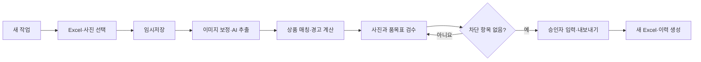

# 약국 거래명세서 입고 반영 도우미 PRD

## 0. 문서 정보

| 항목 | 내용 |
|---|---|
| 상태 | MVP 제품 요구사항 권위 |
| 버전 | 1.5 |
| 수정일 | 2026-08-09 |
| 제품 형태 | 약국 1곳·단일 사용자용 로컬 웹앱 |
| 권위 역할 | 제품 목적·범위·확정 업무 규칙·기능 요구사항 |
| 컨텍스트 진입점 | `docs/00_PROJECT_CONTEXT.md` |
| 역사적 출처 | `handoff.md` |

이 문서의 `필수`, `차단`, `완료 조건`은 MVP 범위다. 세부 기술 결정은 Accepted 상태의 `docs/03_DECISIONS.md`가 구체화하며, `handoff.md`는 과거 요구와 2026-08-08 수정 전 리뷰의 역사적 기록이다. 전체 문서 우선순위는 `docs/00_PROJECT_CONTEXT.md`를 따른다.

### 개발·검증 자료

- 상품리스트: `/Users/kimsangwoo/Downloads/상품리스트_2026-08-07 11_15.xlsx`
- 샘플 사진 1: `/var/folders/mv/dj440zt16s12g5kyg5_yqhdw0000gn/T/codex-clipboard-9100a7a1-28a1-428f-8e9e-46ce0f1876af.png`
- 샘플 사진 2: `/var/folders/mv/dj440zt16s12g5kyg5_yqhdw0000gn/T/codex-clipboard-b30121a5-f1dc-420a-b26c-7d8ff989279b.png`
- 샘플 사진 3: `/var/folders/mv/dj440zt16s12g5kyg5_yqhdw0000gn/T/codex-clipboard-4122d898-a305-488b-93c7-eea19f93b307.png`

위 경로는 검증용이며 코드에 하드코딩하거나 사용자 허락 없이 프로젝트에 복사·커밋하지 않는다. 임시 사진이 사라졌으면 재첨부를 요청한다.

---

## 1. 제품 개요

거래명세서 사진에서 품목·수량·단가를 추출하고 기존 상품리스트와 매칭한 뒤, **백엔드 규칙 또는 사람이 승인한 값만** 원본을 보존한 새 Excel에 반영한다.

### 해결할 문제

- OCR 오류와 유사 상품 오매칭의 자동 반영
- 여러 문서에 반복된 동일 상품의 재고 누락·중복 계산
- 공급자/공급사 혼동과 단가 충돌
- 동일 명세서 재반영
- 원본 훼손과 변경 이력 누락

### 목표

- 사진 3장의 모든 품목을 수정 가능한 검수표로 제공한다.
- 승인·반영 대상의 재고와 단가를 상품코드 단위로 정확히 계산한다.
- 승인되지 않은 행의 Excel 변경을 0건으로 만든다.
- 중복 명세서를 차단하고 모든 승인·제외 결과를 추적한다.

OCR 무오류는 목표가 아니다. **오류를 사람이 고칠 수 있고, 승인되지 않은 행은 반영되지 않는 것**이 성공 기준이다.

### MVP 범위

포함:

- `.xlsx` 상품리스트 1개와 PNG/JPG/JPEG/WEBP 사진 여러 장 업로드
- 이미지 보정, OpenAI 기반 구조화 추출, 기존 상품 후보 추천·수동 선택
- 사용자가 확정한 OCR 매칭 재사용, 미매칭 상품의 명시적 직접 등록
- 행 편집, 승인/보류/제외, 재고·단가 반영 선택, 상태별 일괄 선택
- 상품별 재고 합산, 최신 단가·단가 충돌 처리, 중복 명세서 차단
- 작업 자동 저장·재개, 새 Excel 생성, 로컬 처리 이력

제외:

- 신규 상품 자동 등록, 반품·출고·음수 재고, 가중평균 단가
- 다중 사용자·로그인·권한·클라우드 DB·배포·모바일 앱
- POS/ERP 연동, 공급사별 학습 UI, PDF/HEIC/동영상
- 매칭 근거가 불충분한 OCR 행의 자동 승인, 기존 상품의 이름·규격·공급사 수정

---

## 2. 확정 업무 규칙

1. 새 AI 추출 행은 `보류`로 생성한 뒤, 유일한 코드 정확 일치 또는 90점 이상 후보가 정확히 하나이고 `+재고`가 유효하면 백엔드가 `승인`한다. 90점 이상 후보가 둘 이상이거나 안전 조건을 충족하지 못하면 `보류`를 유지하며, 수기 추가 행은 항상 `보류`로 시작한다.
2. 실제 재고 반영 조건은 `상태=승인 AND 재고 반영=true`다.
3. `상태`, `재고 반영`, `매입단가 반영`은 독립적으로 저장한다. 새 행의 `재고 반영`은 `true`로 시작하며 상태 변경이 체크값을 덮어쓰지 않는다.
4. `+재고`는 OCR 수량으로 초기화하며 사용자가 수정할 수 있는 0 이상의 정수다.
5. 동일 상품 여러 행의 재고는 상품코드별로 합산한다.

   ```text
   재고 증분 = SUM(승인 AND 재고 반영인 행의 +재고)
   최종재고 = 기준 현재고 + 재고 증분
   ```

6. 최종 공급처는 사진 공급자가 아니라 매칭된 Excel 행의 `공급사`다. 사진 공급자는 별도 보관한다.
7. 미매칭 행은 승인할 수 없다. 기존 상품을 선택하거나, 사용자가 신규 상품 정보를 직접 등록하거나, 제외 사유와 함께 `제외`해야 한다. 직접 등록 상품은 원본이 아닌 결과 Excel에 새 행으로 추가한다.
8. 유효한 사진 단가와 기존 단가가 다르면 `매입단가 반영`을 기본 선택하고, 같으면 선택하지 않는다. 기존 단가가 없으면 기본 선택과 함께 경고하며, 사진 단가가 유효하지 않으면 비활성화한다. 사용자는 활성 체크를 변경할 수 있다.
9. 단가 반영 대상은 `상태=승인 AND 매입단가 반영=true`인 행뿐이다.
10. 같은 상품의 단가 후보가 여러 개면 다음 순서로 결정한다.
    - 모두 같음 → 해당 단가
    - 모두 날짜 비교 가능 → 가장 최근 거래일자의 단가
    - 최신 날짜에 서로 다른 단가가 있거나 날짜 비교 불가 → 사용자 대표 단가 선택 전까지 내보내기 차단
11. 다음 중 하나인 확정 중복 명세서는 제거 전까지 내보내기를 차단한다.
    - 이미지 SHA-256이 같음
    - 정규화한 `사진 공급자 + 거래일자 + 명세서번호`가 모두 존재하고 같음
    - 명세서번호가 없고 `사진 공급자 + 거래일자 + 정렬된 품목/수량/단가/금액 + 문서 합계`가 같음
12. 원본 Excel은 절대 수정하지 않는다. 복사본에서 승인 대상의 `현재고`, 선택된 `매입단가`, 이력 시트만 변경한다.
13. 프런트엔드는 즉시 미리보기를 제공하되, 최종 계산·검증·내보내기는 백엔드 규칙을 기준으로 한다.

---

## 3. 사용자 흐름과 화면



### 화면 구성

| 화면 | 필수 기능 |
|---|---|
| 작업 목록 | 새 작업, 미완료 이어하기, 완료 결과 재다운로드·복제, 확인 후 작업 삭제 |
| 업로드 | 새 작업은 Excel·사진 선택 후 임시저장할 때만 생성, 저장된 작업은 파일별 진행·실패·재시도 |
| 검수 | 보류 항목이 있는 사진만 묶은 기본 탐색, 전체 문서 전환, 이미지 뷰어, 편집표, 필터, 자동 저장 |
| 단가 충돌 | 상품별 후보의 문서·날짜·단가·수량 표시, 대표 행/단가 선택 |
| 완료 | 변경 요약, 승인자·처리 시각, 결과 다운로드, 원본 보존 안내 |

검수표에는 문서 정보, OCR 원문/수정값, 상품 검색·매칭, 기준/최종 재고, 기존/사진/최종 단가, 반영 체크, 상태, 경고, 메모를 표시한다. 상태별 `재고 반영` 마스터 체크는 필터와 무관하게 작업 전체에 적용하며 3상태(전체/해제/일부)를 지원한다.

---

## 4. 기능 요구사항

| ID | 요구사항 | 완료 조건 |
|---|---|---|
| FR-01 작업 | 새 업로드 화면의 파일 선택은 `임시저장` 전까지 브라우저에만 두고, 임시저장 후 작업 상태(`초안/추출중/검수중/내보내기중/완료/실패`)와 모든 편집을 SQLite에 자동 저장한다. | 화면 진입·파일 선택만으로 빈 작업이 생기지 않으며, 임시저장 후에는 재시작해도 OCR·수정·매칭·체크·메모가 복구되고 완료 작업은 읽기 전용이다. |
| FR-02 Excel 입력 | `Sheet`에서 헤더명으로 `상품코드/상품명/규격/현재고/매입단가/공급사코드/공급사`를 찾는다. 누락·중복 헤더, 중복 상품코드, 손상·암호화·비-XLSX 파일은 차단한다. | 원본 해시와 상품코드↔행 연결을 저장하고 원본을 수정하지 않는다. |
| FR-03 이미지 | EXIF 방향, 회전·기울기·문서 윤곽·원근을 로컬 보정하고 원본/보정본을 보존한다. 보정 실패 시 원본 사용과 경고를 허용한다. | 한 사진 실패가 다른 사진을 중단하지 않고 파일별 재시도가 가능하며, 검수 화면에서 원본을 열어 클릭마다 90도 회전할 수 있다. |
| FR-04 AI 추출 | OpenAI Responses API의 이미지 입력과 엄격한 JSON Schema로 문서 정보와 모든 품목 행을 순서대로 추출한다. 모르는 값은 `null`로 둔다. | 응답 JSON·모델·프롬프트 버전을 저장하고 스키마 실패를 성공으로 처리하지 않는다. |
| FR-05 품목 편집 | 품목명·규격·수량·단가·금액과 `+재고`를 수정하고 누락 행을 수동 추가할 수 있다. | OCR 최초값과 현재값을 보존하며 수정 즉시 검증을 재계산한다. |
| FR-06 상품 매칭 | 코드 정확 일치 → 사용자가 확정한 OCR 별칭 → 정규화 상품명+규격 → 유사도 순으로 최대 5개 후보를 제시한다. 가격은 보조 신호만 사용한다. 미매칭 화면에서는 사용자가 상품코드·상품명·규격·현재고·매입단가·공급사 정보를 직접 등록할 수 있다. | 사용자가 수동 확정한 OCR 코드 또는 상품명+규격은 이후 작업에서 같은 상품코드가 기준 Excel에 있을 때 자동 매칭한다. 유일 코드 정확 일치 또는 90점 이상 후보가 정확히 하나일 때도 자동 매칭하며, 경쟁 후보는 수동 선택을 기다린다. 직접 등록 상품은 현재 작업에만 생성하고 결과 Excel 새 행에 기록하며 원본은 보존한다. 자동 매칭 행과 사용자가 명시적으로 선택·반영하거나 직접 등록한 행은 `+재고`가 유효할 때 승인한다. |
| FR-07 검수 상태 | 승인/보류/제외와 두 반영 체크를 독립 관리하고 상태·체크의 행별/일괄 변경을 지원한다. 검수 화면은 보류 항목이 있는 사진만 기본 표시하고 전체 문서 보기로 전환할 수 있다. | 집계의 보류 수를 누르면 첫 보류 사진의 추출 품목으로 이동한다. 집계 상품명을 누르면 페이지 이동 없이 좌측 집계·우측 관련 행 편집의 분할 화면이 열리고, 좁은 화면에서는 세로로 전환된다. 미매칭·유효하지 않은 `+재고` 행은 승인되지 않고 제외에는 사유가 필요하며, 마지막 보류 행 처리 후 다음 보류 사진으로 이동한다. |
| FR-08 계산 | 상태·매칭·수량·체크·날짜 변경 시 재고, 단가, 경고, 내보내기 가능 여부를 즉시 재계산한다. | 정수 연산과 확정 업무 규칙의 결과가 단위 테스트와 일치한다. |
| FR-09 경고 | 금액 불일치, 낮은 신뢰도, 단가 30% 이상 차이, 공급사 불일치, 묶음/세트, 이미지 품질, 문서 정보 누락을 주의로 표시한다. | 원본 값과 계산 근거를 확인할 수 있고 주의만으로 내보내기를 막지 않는다. |
| FR-10 중복 | 현재 작업과 완료 이력에서 이미지 해시, 문서 식별키, 정렬된 품목 서명을 비교한다. | 확정 중복은 차단하고 유사 문서는 `중복 의심` 주의만 표시한다. |
| FR-11 내보내기 | 서버가 최신 DB 상태를 재검증하고 임시 복사본에 변경을 적용한 후 다시 열어 검증한다. | 성공 시에만 원자적으로 결과를 확정하며 중복 제출로 파일·이력이 이중 생성되지 않는다. |
| FR-12 이력 | 승인 행은 `입고반영내역`, 제외 행은 `검수제외내역`에 원문·수정값·매칭·변경값·근거·승인 정보를 기록한다. | 모든 승인·제외 결과를 작업 ID와 원본 파일 해시로 추적할 수 있다. |

AI 최소 추출 스키마:

```text
document: photo_supplier, transaction_date, invoice_number, document_total,
          raw_header_text, confidence_by_field
items[]:  source_row_order, raw_row_text, product_code_or_barcode,
          product_name, specification, quantity, unit_price, amount,
          bundle_or_set_text, confidence_by_field, extraction_warnings
```

### 내보내기 차단 조건

- 처리 실패 문서 또는 `보류` 행이 남아 있음
- 미매칭 행이 제외되지 않았거나 승인 행의 `+재고`가 유효하지 않음
- 기준 현재고·상품코드 식별이 유효하지 않음
- 해결되지 않은 단가 충돌 또는 확정 중복 문서가 있음
- 승인자 이름이 없거나 출력 검증이 실패함

### 출력 Excel

- 파일명: `상품리스트_입고반영_YYYYMMDD_HHMMSS.xlsx`
- 기존 `Sheet`: 상품코드로 행을 재확인해 승인 대상의 `현재고`와 선택된 `매입단가`만 수정
- `입고반영내역`: 문서/파일 해시, OCR 원문·수정값, 매칭 근거, 전후 재고·단가, 체크, 경고, 메모, 승인자·시각
- `검수제외내역`: 문서/파일 해시, 원문·수정값, 마지막 후보, 제외 사유, 경고, 메모, 검수자·시각
- 승인 대상 외 값·수식·핵심 스타일, 병합, 행·열 순서, 크기, 숨김, 틀 고정을 보존
- 기존 이력 시트가 있으면 호환 헤더를 확인해 이어 쓰고, 호환되지 않으면 차단

---

## 5. 데이터와 기술 기준

### 환경·보안

- Python 3.12 + FastAPI, React + TypeScript + Vite
- SQLite + SQLAlchemy + Alembic, openpyxl, Pillow/OpenCV, RapidFuzz
- pytest + Vitest + Playwright
- `OPENAI_API_KEY`는 환경변수로만 읽고 화면·DB·로그·Excel에 저장하지 않는다.
- 모델은 `OPENAI_MODEL`로 교체 가능하게 하고 구현 시 공식 비전 가이드의 지원 모델을 확인한다.
- 이미지 1장만 OpenAI에 전송하며 전체 상품리스트와 이미지 Base64를 로그·외부 API에 보내지 않는다.
- 로컬 API는 `127.0.0.1`에 바인딩하고 업로드 실제 저장명은 UUID를 사용한다.
- KRW, 0 이상의 정수 수량·단가, `Asia/Seoul`, 한국어 UI를 사용한다.

### 최소 데이터 모델

| 테이블 | 핵심 데이터 |
|---|---|
| `jobs` | 상태, 원본 Excel 경로·이름·해시, 승인자, 결과 경로, 생성/완료 시각 |
| `documents` | 작업, 원본/보정 이미지, 해시, 처리 상태, 문서 정보, 모델 응답, 중복 상태 |
| `items` | OCR 원본·수정값, 매칭 결과·후보, 기준 재고·단가, 반영 체크, 검수 상태·경고 |
| `product_index` | 작업 기준 Excel의 상품 행과 사용자가 현재 작업에서 직접 등록한 신규 상품 |
| `learned_matches` | 사용자가 확정한 정규화 OCR 코드 또는 상품명+규격과 실제 상품코드의 전역 연결 |
| `price_resolutions` | 상품코드, 자동/수동 해결 방식, 선택 행·단가 |
| `completed_documents` | 완료 문서의 해시·문서 식별키·품목 서명 |

DB 마이그레이션과 스키마 버전을 관리한다. 완료 문서는 출력 생성·재검증 성공 뒤에만 중복 기준으로 확정한다.

---

## 6. Scaffolding 구조

현재 저장소 루트를 프로젝트 루트로 사용한다. 실제 사용자 데이터가 들어가는 `data/`는 버전 관리에서 제외한다. 아래 코드는 최초 구현 계획의 모듈 역할도이며, 현재 코드 구조의 권위는 `docs/02_ARCHITECTURE.md`다.

```text
inventory_uploader/
├── backend/
│   ├── app/
│   │   ├── main.py                 # FastAPI 생성, 정적 프런트 제공
│   │   ├── core/
│   │   │   ├── config.py           # 환경변수·경로·시간대
│   │   │   └── database.py         # SQLite 세션
│   │   ├── api/
│   │   │   ├── jobs.py             # 작업 생성·조회·복제
│   │   │   ├── documents.py        # 사진 업로드·추출·재시도
│   │   │   ├── items.py            # 품목 편집·매칭·상태 변경
│   │   │   └── exports.py          # 사전 검증·Excel 다운로드
│   │   ├── models/                 # SQLAlchemy 테이블
│   │   ├── schemas/                # API·AI 구조화 출력 스키마
│   │   └── services/
│   │       ├── excel.py             # 입력 검증·복사·출력 검증
│   │       ├── image.py             # EXIF·문서 보정
│   │       ├── extraction.py        # OpenAI 요청·재시도·응답 저장
│   │       ├── matching.py          # 정규화·후보 순위·검색
│   │       ├── review.py            # 경고·승인 가능 여부
│   │       ├── inventory.py         # 상품별 재고 집계
│   │       ├── pricing.py           # 기본 체크·최신 단가·충돌
│   │       ├── duplicates.py        # 문서 해시·서명 판정
│   │       └── export.py            # 원자적 Excel 생성·이력 확정
│   ├── alembic/
│   ├── tests/
│   │   ├── unit/
│   │   ├── integration/
│   │   └── fixtures/               # 비식별화된 최소 테스트 자료
│   └── pyproject.toml
├── frontend/
│   ├── src/
│   │   ├── api/                     # 백엔드 클라이언트
│   │   ├── components/              # 공용 UI
│   │   ├── features/
│   │   │   ├── jobs/
│   │   │   ├── upload/
│   │   │   ├── review/
│   │   │   └── export/
│   │   ├── pages/                   # 목록·업로드·검수·완료
│   │   ├── types/
│   │   └── main.tsx
│   ├── tests/
│   └── package.json
├── e2e/                             # Playwright 핵심 사용자 흐름
├── data/                            # app.db, uploads, corrected, exports (git 제외)
├── scripts/                         # 로컬 실행·검증 진입점
├── .env.example
├── .gitignore
├── AGENTS.md                       # 프로젝트 실행·검증 규칙
├── docs/
│   ├── 00_PROJECT_CONTEXT.md       # 단일 컨텍스트 진입점
│   ├── 02_ARCHITECTURE.md          # 현재 구현 아키텍처
│   ├── 03_DECISIONS.md             # 확정·보류 결정
│   ├── 04_ACCEPTANCE_CRITERIA.md    # 기준별 검증 증거
│   ├── 05_CURRENT_STATUS.md         # 현재 상태와 남은 위험
│   └── 06_BACKLOG.md                # 미완료 작업
├── README.md
├── PRD.md
└── handoff.md                      # 역사적 요구·수정 전 리뷰
```

구조 원칙:

- 업무 규칙은 `backend/app/services/`에 두고 API 핸들러와 UI 이벤트에 중복 구현하지 않는다.
- 프런트엔드는 기능 단위로만 나누고 단일 용도 추상화는 추가하지 않는다.
- 샘플·실데이터는 `data/`나 테스트 픽스처에 무단 복사하지 않는다.
- 프로덕션 로컬 실행에서는 FastAPI가 빌드된 프런트 정적 파일을 함께 제공한다.

---

## 7. 단계별 구현 계획

각 단계는 테스트를 먼저 구체화하고, 완료 조건을 통과한 뒤 다음 단계로 진행한다.

### Step 0. 골격과 실행 기반

대상: 공통 실행·저장 기반

구현:

- 위 디렉터리, 백엔드/프런트 최소 앱, 설정, DB 연결, 마이그레이션, 헬스 체크
- `.env.example`, `.gitignore`, 로컬 단일 실행 진입점

검증:

- 백엔드·프런트가 한 번의 안내된 절차로 실행된다.
- `data/`, API 키, 사용자 입력 파일이 버전 관리 대상에서 제외된다.

### Step 1. Excel 안전 계층

대상: FR-02, AC-10

구현:

- Excel 업로드, `Sheet`·필수 헤더·상품코드 고유성 검증
- 상품 색인과 원본 해시 저장
- 가짜 승인 데이터로 복사본의 지정 셀·이력 시트만 수정

검증:

- 원본 해시가 유지되고 승인 대상 외 값·수식·핵심 서식 비교가 통과한다.
- 잘못된 파일·헤더·중복 상품코드는 명확한 이유로 차단된다.

### Step 2. 이미지·AI 추출 파이프라인

대상: FR-03~FR-05, AC-01

구현:

- 다중 이미지 업로드, 원본/보정본 저장, 파일별 상태·재시도
- OpenAI 구조화 출력 스키마, 응답 저장, 제한된 재시도
- OCR 원본/수정 필드와 수동 행 추가

검증:

- 샘플 3장의 모든 품목이 문서별 원순서로 검수 데이터에 나타난다.
- 스키마/API 실패는 해당 문서 실패로 남고 다른 문서는 계속 처리된다.

### Step 3. 매칭·검증 엔진

대상: FR-06, FR-09~FR-10, AC-02, AC-08~AC-09

구현:

- 코드/정규화명/규격 기반 후보 생성과 상품 검색
- 자동 확정 임계값, 중복 상품명 차단, 경고 계산
- 문서 해시·식별키·품목 서명 기반 중복 판정

검증:

- 자동 확정 경계, 후보 순위, 미매칭, 공급사 불일치, 금액·단가 경고 단위 테스트가 통과한다.
- 완료 문서 재업로드가 파일명 변경과 무관하게 차단된다.

### Step 4. 검수 UI와 자동 저장

대상: FR-01, FR-05, FR-07~FR-08, AC-04~AC-05, AC-08, AC-12

구현:

- 작업 목록·업로드·2단 검수 화면
- 행 편집, 검색/선택, 상태·반영 체크, 필터, 제외 사유, 메모
- 상태별 3상태 마스터 체크, 자동 저장, 작업 재개

검증:

- 상태와 체크가 독립적으로 유지되고 필터 중 일괄 변경도 전체 대상에 적용된다.
- 미매칭 승인 차단과 앱 재시작 후 작업 복구가 통과한다.

### Step 5. 집계·단가·안전한 내보내기

대상: FR-08, FR-11~FR-12, AC-03, AC-06~AC-07, AC-10~AC-11

구현:

- 상품코드별 재고 합산과 단가 기본 체크
- 최신 날짜 자동 선택, 동일 날짜/날짜 누락 충돌 해결 UI
- 서버 사전 검증, 원자적 Excel 생성, 이력 시트, 완료 이력 확정

검증:

- 승인·체크 조합별 재고/단가 결과가 업무 규칙과 일치한다.
- 해결되지 않은 충돌·중복·보류·미매칭은 내보내기를 차단한다.
- 출력 재검증 실패 시 결과·완료 이력이 확정되지 않는다.

### Step 6. 전체 회귀와 전달

대상: FR-01~FR-12, AC-01~AC-13

구현:

- 샘플 전체 E2E, 실패·재시도·중복 회귀 테스트
- 설치·실행·API 키·백업·기본 사용법 문서화

검증:

- 아래 수용 기준 전체와 자동화 테스트가 통과한다.
- `README.md`만으로 새 환경에서 설치·실행할 수 있다.

---

## 8. 핵심 수용 기준

| ID | 시나리오 | 기대 결과 |
|---|---|---|
| AC-01 | 사진 3장 업로드 | 회전·원근과 무관하게 모든 품목이 순서대로 나타나고 누락은 수동 추가 가능 |
| AC-02 | 사진 2의 마운자로 5mg/0.5mL, 수량 2, 단가 369,307원 매칭 | 최종 공급처는 사진 공급자가 아닌 Excel의 `백제약품` |
| AC-03 | 바로타민 kids 미네랄, 수량 8, 사진 18,000원·기존 20,000원 | 단가 반영 기본 선택, 해제 시 20,000원 유지, 재선택 시 18,000원 |
| AC-04 | 보류↔승인 전환 및 재고 체크 변경 | 체크값은 유지되고 `승인 AND 재고 반영`일 때만 최종재고에 포함 |
| AC-05 | 승인 5행 중 2행 체크, 필터 적용 후 마스터 체크 | 일부 선택 표시, 작업 전체 5행 적용, 개별 해제 후 일부 선택 복귀 |
| AC-06 | 기준재고 10, 같은 상품의 `+재고` 2·3·4 중 2·3만 반영 | 관련 모든 행과 Excel의 최종재고가 15 |
| AC-07 | 8/1 10,000원, 8/3 11,000원·12,000원 | 최신 날짜를 우선하되 최신 날짜 내 충돌은 수동 선택 전까지 차단 |
| AC-08 | 미매칭 행 승인 시도 | 승인 차단, 상품 수동 선택 또는 사유 있는 제외 후 해제 |
| AC-09 | 완료 명세서 재업로드 | 파일명 변경·재촬영 여부와 무관하게 확정 중복 조건 충족 시 차단 |
| AC-10 | 내보내기 전후 비교 | 원본 해시 동일, 승인 대상·이력 외 기존 값·수식·핵심 서식 보존 |
| AC-11 | 보류·제외 또는 반영 체크가 해제된 승인 행 | 기존 재고·단가에 영향 없음, 검수 이력에는 기록 |
| AC-12 | 검수 중 앱 재시작 | OCR·수정값·매칭·체크·상태·메모 완전 복구 |
| AC-13 | 사진 2장 중 첫 사진은 승인만 있고 둘째 사진에 보류 행이 있으며, 후보 점수가 각각 `[0.91, 0.89]`와 `[0.95, 0.90]`인 행을 매칭 | 기본 검수 목록에는 둘째 사진만 나타나고, 전자는 자동 승인되어 보류에서 빠지며 후자는 보류·수동 선택을 유지한다. 전체 문서 보기로 두 사진을 모두 확인할 수 있다. |
| AC-14 | 사용자가 OCR 상품을 기존 상품에 수동 매칭한 뒤 다음 작업에서 같은 OCR 별칭을 다시 추출 | 새 기준 Excel에 해당 상품코드가 있으면 후보를 다시 묻지 않고 저장된 상품으로 자동 매칭·승인하며, 상품코드가 없으면 기존 후보 검수를 유지한다. |
| AC-15 | 미매칭 행에서 `사용자 직접 등록`으로 신규 상품을 입력하고 내보내기 | 입력값과 최종 재고·단가가 결과 Excel의 새 상품 행에 기록되고, 해당 품목은 등록 상품에 매칭되며 원본 Excel 해시는 변하지 않는다. |

---

## 9. 비기능·완료 기준

- 기준 규모: 약 8,563행×52열 Excel, 사진 20장 이하
- 검색 결과 300ms 이내, 편집 후 파생값 200ms 이내 갱신 목표(AI 처리 시간 제외)
- 금액·재고는 정수 연산, 내보내기 잠금으로 중복 결과 생성을 방지한다.
- 오류는 한국어로 원인과 다음 행동을 함께 표시하고 민감정보 없는 오류 ID만 노출한다.
- 키보드 검수, 색상 외 텍스트/아이콘 상태 표시, 1280px 이상 데스크톱 화면을 지원한다.
- API·Excel 실패가 원본이나 검수 데이터를 잃게 하지 않는다.

MVP 완료 조건:

- FR-01~FR-12와 AC-01~AC-13이 모두 통과한다.
- 샘플 3장의 업로드→검수→내보내기→결과 재열기 흐름을 실제 검증한다.
- 승인되지 않은 행, 체크 해제 행, 확정 중복 문서가 Excel을 변경하지 않는다.
- 원본과 승인 대상 외 데이터·서식 보존 테스트가 통과한다.
- 테스트 실패, 임시 디버그 코드, 사용자 경로 하드코딩, 실제 API 키가 남아 있지 않다.

## 10. 구현 시 확인할 외부 문서

- OpenAI 이미지 입력: https://developers.openai.com/api/docs/guides/images-vision
- OpenAI 구조화 출력: https://developers.openai.com/api/docs/guides/structured-outputs

OpenAI 모델·SDK는 구현 시점의 공식 문서와 설치 버전을 확인한다. 모델 교체는 이 PRD의 업무 규칙이나 수용 기준을 바꾸지 않는다.

## 11. 사용자 확인이 필요한 변경

현재 MVP 구현을 막는 미결정 사항은 없다. 다음은 임의로 확장하지 않고 사용자 확인을 받는다.

- 외부 서비스·월 비용, 로그인·다중 사용자·클라우드 배포 추가
- 반품·음수 재고·신규 상품 자동 등록·확정 중복 강제 반영
- 매입단가 결정 정책 또는 Excel 원본 구조 변경
